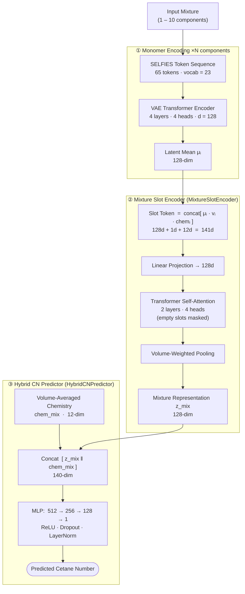

# Architectural Documentation: SELFIES VAE + Attention Mixture Model

This document describes the design, key components, training workflow, and inference pipelines of the optimized Transformer-based SELFIES VAE + Attention Mixture model for Cetane Number (CN) predictions of hydrocarbon fuel mixtures.

---

## 1. Overview & High-Level Architecture

Predicting fuel properties for complex, multi-component mixtures (especially oxygenates) is highly challenging because mixing is often non-additive. The model uses a two-stage representational learning approach combined with a component-set attention encoder to capture complex nonlinear blending phenomena.

---

## 2. Key Components

### A. Tokenizer & SELFIES Representation
- **Vocab Mapping**: Standardizes molecular structure input using **SELFIES** (Self-Referencing Embedded Strings) rather than SMILES, eliminating invalid chemical structure representations.
- **Maximum Length**: Standardized to 65 tokens (including BOS and EOS tokens), padding empty components with `<pad>` tokens.

### B. VAE Molecular Encoder
- **Architecture**: Bidirectional Transformer Encoder (`d_model=128`, `latent_dim=128`, 4 layers, 4 heads, `d_ff=512`).
- **Function**: Maps individual hydrocarbon molecules into a continuous 128-dimensional latent space.

### C. Hand-Crafted Chemistry Features
To supply direct chemical signals alongside learned latent representations, a 12-dimensional descriptor vector is extracted per component using RDKit:
1. **Carbon Count** (C)
2. **Hydrogen Count** (H)
3. **C/H Ratio**
4. **Degree of Unsaturation** (DoU)
5. **Heavy Atom Count**
6. **Oxygen Count** (O)
7. **Hydrogen Bond Donors** (HBD)
8. **TPSA** (Topological Polar Surface Area)
9. **Rotatable Bonds Count**
10. **Number of Rings**
11. **Branching Proxy** (degree of carbon branch points)
12. **Stereocenter Presence** (boolean)

### D. Attention-Based Mixture Slot Encoder (`MixtureSlotEncoder`)
- **Tokens Creation**: For each of the 10 slots, it builds a token vector by concatenating component latent `μ_i` (128d), volume fraction scalar `v_i` (1d), and component chemistry features `chem_i` (12d).
- **Transformer Processing**: A 2-layer, 4-head Transformer encoder runs self-attention over the active slots, allowing the model to learn interactive, nonlinear blending rules (e.g. binary and ternary interactions).
- **Masking**: Empty component slots (`v_i = 0`) are masked from attention, preventing padding tokens from polluting predictions.
- **Pooling**: Volume-weighted pooling over the attended slot representations produces the final mixture representation `z_mix` (128d).

### E. Hybrid Property Predictor
- **Inputs**: Concatenates mixture latent `z_mix` (128d) and volume-averaged mixture chemistry features `chem_mix` (12d).
- **Network**: Multi-layer perceptron (MLP) with dimensions `(512, 256, 128)` mapping to a single continuous output (predicted Cetane Number).

---

## 3. Three-Stage Training Workflow

1. **Stage 1 (VAE Pretraining)**: Pretrains the VAE model on single molecules to reconstruct token sequences, using auxiliary regression targets (10 RDKit descriptors) to keep the latent space chemistry-aware.
2. **Stage 2 (Frozen VAE)**: Freezes the VAE weights and trains only the `MixtureSlotEncoder` and `HybridCNPredictor` to predict mixture Cetane Numbers. Uses a focal-style loss to focus on high-error samples.
3. **Stage 3 (Joint Fine-Tuning)**: Unfreezes the VAE encoder and jointly fine-tunes all components (VAE encoder, slot encoder, predictor) end-to-end to maximize performance.

---

## 4. Inverse Design (Fuel Discovery)

The inverse design script performs Bayesian Optimization (using BoTorch GP-EI) or gradient-free Hill-Climbing inside the VAE latent space to discover new fuel structures targeting a specific Cetane Number.
- **Objective**: Maximizes proximity to the target Cetane Number (maximizing `-abs(predicted_CN - target_CN)`).
- **Monomer Decoding**: Proposed VAE latent vectors are passed to the VAE decoder to reconstruct SELFIES and canonical SMILES, which are validated using RDKit.
