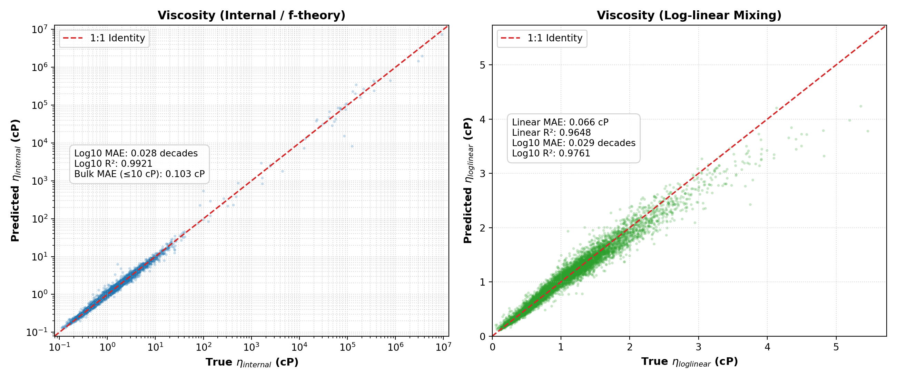

# Viscosity 2DGC Model

Predicts liquid hydrocarbon viscosity properties (`eta_internal_cP` and `eta_loglinear_cP`) across broad temperature and pressure regimes from 2D-GC hydrocarbon-class bin mass-fraction distributions, temperature (`T_K`), and pressure (`P_bar`).

---

## Directory Structure

```
viscosity/
├── README.md
├── scripts/
│   └── train_visc_2dgc_export.py   # Training, evaluation & ONNX export script
└── models/
    └── visc_2dgc/
        ├── visc_2dgc_seed{0..4}.joblib   # 5-seed ensemble (sklearn MultiOutputRegressor)
        ├── visc_2dgc_seed0.onnx          # ONNX export — seed 0 with direct cP outputs (2.8 MB)
        ├── visc_2dgc_meta.json           # Training metadata & comprehensive metrics
        └── visc_2dgc_parity.png          # Validation parity plot (internal & loglinear)
```

---

## Input Features (191 total)

### 1. 2DGC Hydrocarbon Bins (189 bins)

| Hydrocarbon class    | Carbon range | Bins | Column Prefix |
|----------------------|-------------|------|------------------------------|
| n-paraffin           | C1–C30      | 30   | `w_n_paraffin_C1` … `w_n_paraffin_C30` |
| iso-paraffin         | C4–C30      | 27   | `w_iso_paraffin_C4` … `w_iso_paraffin_C30` |
| mono-naphthene       | C5–C30      | 26   | `w_mono_naphthene_C5` … `w_mono_naphthene_C30` |
| di-naphthene         | C10–C30     | 21   | `w_di_naphthene_C10` … `w_di_naphthene_C30` |
| tri-naphthene        | C14–C30     | 17   | `w_tri_naphthene_C14` … `w_tri_naphthene_C30` |
| mono-aromatic        | C6–C30      | 25   | `w_mono_aromatic_C6` … `w_mono_aromatic_C30` |
| naphtheno-aromatic   | C9–C30      | 22   | `w_naphtheno_aromatic_C9` … `w_naphtheno_aromatic_C30` |
| di-aromatic          | C10–C30     | 21   | `w_di_aromatic_C10` … `w_di_aromatic_C30` |

### 2. Thermodynamic State (2 features)

| Feature | Description | Unit | Range in Dataset |
|---------|-------------|------|-------------------|
| `T_K`   | Temperature | K    | 74.2 – 849.2 K    |
| `P_bar` | Pressure    | bar  | 1.0 – 1000.0 bar  |

---

## Output Targets

1. **`eta_internal_cP`**: Friction-theory ($f$-theory) liquid viscosity in centiPoise [cP]. Spans from low-viscosity light ends up to cryogenic high-viscosity conditions ($> 10^4$ cP).
2. **`eta_loglinear_cP`**: Standard log-linear component mixing rule viscosity in centiPoise [cP] (0.05 – 8.07 cP).

---

## Model Architecture & Performance

- **Algorithm:** `MultiOutputRegressor(HistGradientBoostingRegressor)` (sklearn) — 5-seed ensemble
- **Training Space:** $\log_{10}(\text{viscosity})$ for physical scaling across orders of magnitude and outlier resilience.
- **Dataset:** 101,220 rows from `model_training/viscosity_2dgc/visc_2dgc_selfies_train.dat` (`window_ok == True`, `phase == 'liquid'`).
- **Validation Split:** 90/10 per seed, plus independent holdout evaluation.

### Performance Summary

| Metric | $\eta_{internal}$ (f-theory) | $\eta_{loglinear}$ (mixing) |
|--------|------------------------------|-----------------------------|
| **5-Fold CV Log₁₀ MAE** | 0.0365 ± 0.0004 decades | 0.0347 ± 0.0002 decades |
| **Ensemble Log₁₀ MAE**  | **0.0278 decades** | **0.0292 decades** |
| **Ensemble Log₁₀ R²**   | **0.9921** | **0.9761** |
| **Linear MAE (Bulk ≤ 10 cP)** | **0.103 cP** | **0.066 cP** |
| **Median Absolute Error** | **0.043 cP** | **0.039 cP** |
| **Linear R²**           | — | **0.9648** |

### Parity Plot
Validation parity across both targets:



---

## Training

To retrain the model from the repository root:

```bash
conda activate intensors
python viscosity/scripts/train_visc_2dgc_export.py \
    --input   model_training/viscosity_2dgc/visc_2dgc_selfies_train.dat \
    --out_dir viscosity/models/visc_2dgc \
    --n_jobs  2
```

> **Note on compute resources:** Training defaults to `--n_jobs 2` to leave CPU cores free for general workstation tasks.

---

## Inference

### Python (Sklearn Ensemble)

```python
import json
from pathlib import Path
import joblib
import numpy as np

# Load metadata and ensemble models
meta = json.loads(Path("viscosity/models/visc_2dgc/visc_2dgc_meta.json").read_text())
feature_cols = meta["feature_cols"]

models = [joblib.load(f"viscosity/models/visc_2dgc/visc_2dgc_seed{i}.joblib") for i in range(5)]

# X: np.ndarray of shape (N, 191) with columns strictly matching feature_cols
# Predict in log10 space across ensemble, then exponentiate to cP
log10_preds = np.mean([m.predict(X) for m in models], axis=0)
viscosity_cP = 10.0 ** log10_preds

eta_internal_cP  = viscosity_cP[:, 0]
eta_loglinear_cP = viscosity_cP[:, 1]
```

### ONNX Runtime (Direct cP Outputs)

The exported ONNX model includes an embedded post-processing power node (`Pow(10, y)`), so inference directly outputs centiPoise:

```python
import onnxruntime as ort
import numpy as np

sess = ort.InferenceSession("viscosity/models/visc_2dgc/visc_2dgc_seed0.onnx")

# X: float32 array of shape (N, 191)
preds_cP = sess.run(None, {"float_input": X.astype(np.float32)})[0]

eta_internal_cP  = preds_cP[:, 0]
eta_loglinear_cP = preds_cP[:, 1]
```
